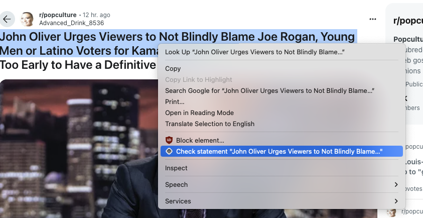
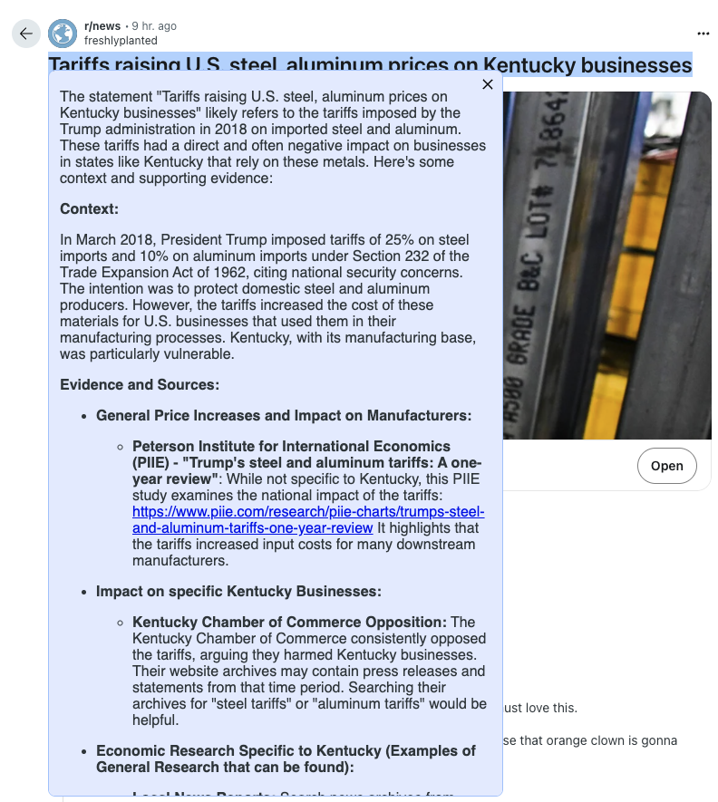

# Statement Verifier

This is a plugin that provides more context on statements you read online.
It interacts with Gemeni to gather informantion about a selected text.

### Example Images:

|                            Text Selection                            |                             Answer                              |
|:--------------------------------------------------------------------:|:---------------------------------------------------------------:|
|  |  |

## Compatibility

Chromium

- **manifest** v3

## Development

To start developing, install yarn packages

```bash
yarn install
```

Then run in `dev`

```bash
yarn dev
```

## Making production build

Run the following:

```bash
yarn build
```

should create a build in [build/chrome-mv3-prod](build/chrome-mv3-prod)

### Packaging the build

```bash
yarn package
```

should create a zip in [build/chrome-mv3-prod.zip](build/chrome-mv3-prod.zip)

This is a production bundle the extension, ready to be zipped and published to the stores.

## Credits

> Project is bootstrapped using [Plasmo extension](https://docs.plasmo.com/)